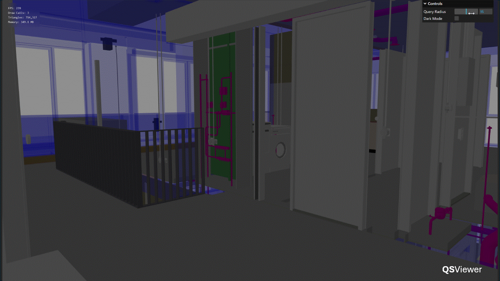
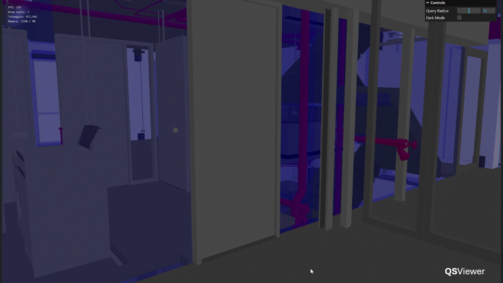
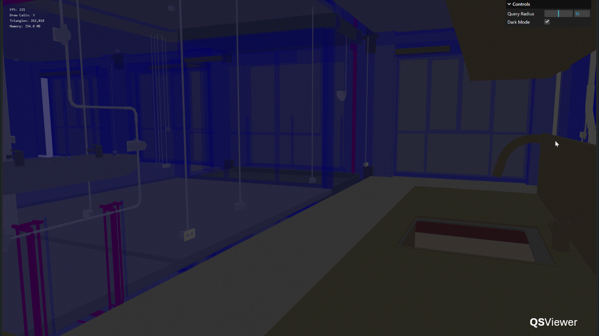
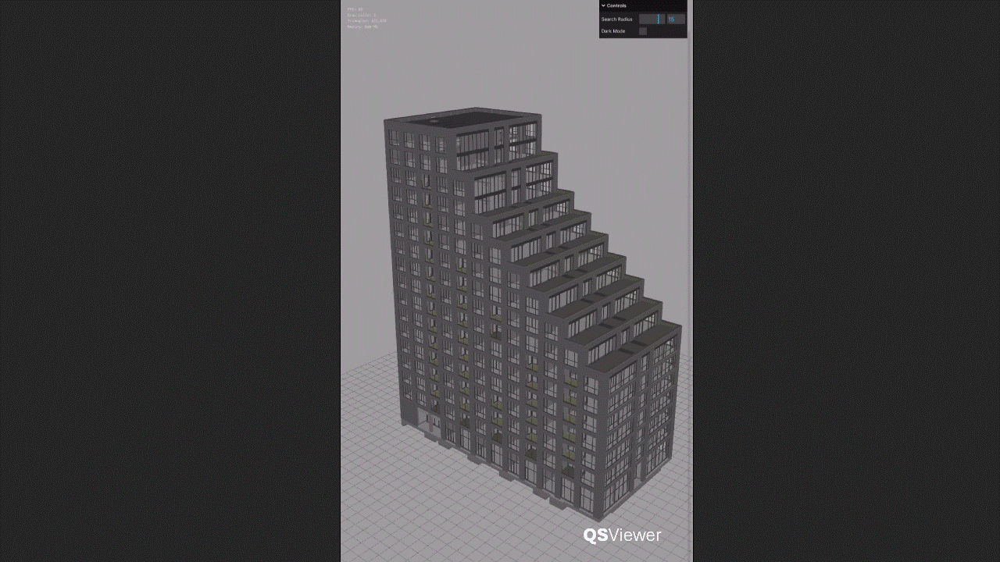

# QSViewer

A novel way to view BIM models.


Construction 3D models face unique challenges on the technology front.

- They are large, requiring high memory utilization,
- They are dense, drawing high amounts of GPU usage,
- They are often poorly modelled, needing high upfront CPU bandwidth.

QSViewer addresses these challenges while providing a lightweight, web-based viewing experience that changes context as you move around. The demo piece is a 800MB ifc model of a highrise residential development, containing 78k modelled objects, 6 disciplinary layers, and 37 Million triangles, that runs at 240 FPS.

[See these results for yourself](https://suryashch.github.io/QSViewer/).

---

## Features

Context Shifts as you do.


Adjust the Query Radius, as needed.



Double Click to center on an object.



Dark mode, on demand.



Works on Mobile.



---

## How it Works

The engine works by determining the closest objects to the camera, using a spatial search tree. These objects represent a small subset of the total, and change as the user moves around. The rest of the time, the engine loads the lightweight facade and nothing else.


Additional details are available in the accompanying report, [A Game Developer's Approach to BIM](reports/a-game-dev-approach-to-bim.md)

---

## Reproducibility

This project is intended to be a proof of concept only. This may change depending on community feedback.

To reproduce these results locally, clone the repo.

```bash
git clone https://github.com/suryashch/QSViewer.git
```

Download the required packages (listed in package-lock.json).

```bash
npm install
```

Run the application.

```bash
npm run
```

Or, open `index.html` in a browser.

---

Model Credits: [buildingSmart Community](https://github.com/buildingsmart-community).

Built with [three.js](https://threejs.org/) and [three-mesh-bvh](https://github.com/gkjohnson/three-mesh-bvh).

Code may be reused / edited with proper attribution.