# A Game Developer's Approach to BIM

> Building Information Modelling (BIM) is a construction-native technology solution that sits at the intersection of data management and 3D modelling. It abets the vast amounts of data produced on a construction site, with a 3D visual user interface. However, widespread adoption is lacking in the North American market, and I believe one of the key hurdles to integration is on the technology front, where efficient open source tools are limited or lacking.

Construction 3D models face unique challenges in the computer graphics space. They are large (high memory), dense (high GPU usage), and often bloated with unnecessary data (high CPU usage). These challenges compound to create a slow, buggy user experience that ultimately kills any motivation behind using it as a tool. Video games however, have been able to render vast worlds on extremely limited hardware for years. In this paper I highlight best practices, grounded in game development principles, to speed up the performance of these 3D models- all while remaining accessible to *anyone* with a web browser.


This research builds on [prior work](improving-3d-model-performance-with-LOD.md), which I highly recommend you check out. As well, the primary intent of this paper is to build intuition, so code and technical wording will be limited. The [full repository](https://github.com/suryashch/LOD-control-with-threeJS), and accompanying [research body of knowledge](../research/optimizing-the-scene/batchedmesh-with-LOD.md) provide additional details to those interested.

## Background and Model

In this project we shall be working with an open source library known as [three.js](https://threejs.org/). While there are better dedicated options for working with 3D models, threejs' selling point is that anyone can access your scene through a simple web browser- no downloads needed. Once created, the scene can be sent to anyone via URL and and can be opened just through a web browser.

That said, the concepts explained in the rest of this paper can be easily reproduced in your tool of choice.

The model we shall be working with is of a real high-rise residential building in the Netherlands called [Sixty5](https://www.strijp-s.nl/en/building/sixty5), courtesy of the [buildingsmart-community](https://github.com/buildingsmart-community). The model consists of 59,778 objects spread across 5 layers.

Here are some screenshots showing what the model looks like.

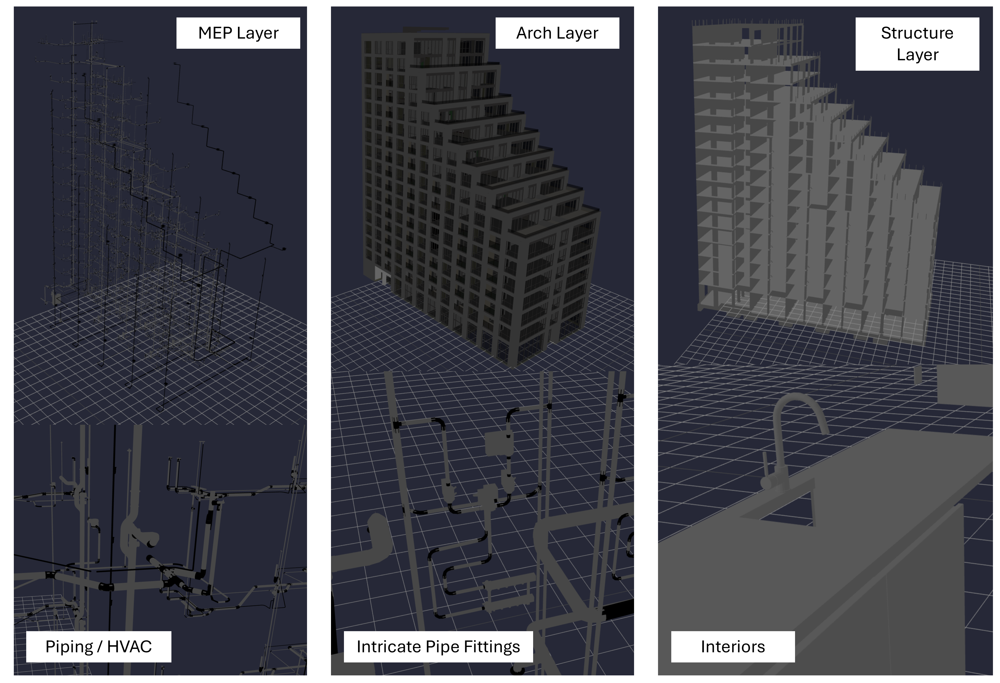

And here is a breakdown of the data.

| Model Layer | No. Objects | No. Triangles | File Size (MB) |
| ----------- | ----------- | --------------------- | ----------- |
| Structural | 605 | 55,059 | 7.2 MB |
| Architectural | 19,980 | 1,639,524 | 334.5 MB |
| Mechanical (MEP) | 22,545 | 8,461,426 | 216.9 MB |
| HVAC | 13,553 | 15,099,433 | 112.2 MB |
| Interiors | 3,095 | 1,607,878 | 48.5 MB |
| **Total** | **59,778** | **26,863,320** | **719.3 MB** |

The MEP and HVAC models alone account for ~23M of the total triangles. This project is a significant scale-up from previous work, and should be reflective of the vast majority of BIM projects.

## Draw Calls

A 3D mesh consists of points connected by lines (known as `vertices` and `edges`). 3 `edges` combine in a loop to form a `triangle`- the smallest unit of work for a GPU. The less triangles there are on the screen, the less strain there will be on the hardware of your computer.

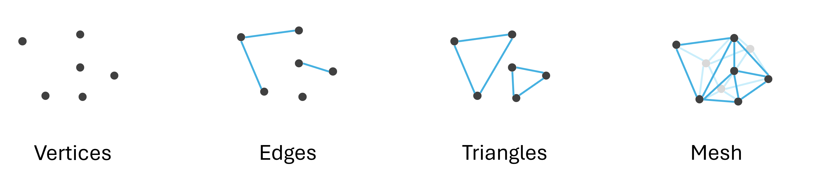

[In prior work](per-object-lod-control-with-threejs.md), we were able to establish that dynamic switching between low and high resolution meshes improves performance of a 3D scene. In that example, the piperack mesh in the scene rendered in low resolution (less triangles) initially (shown in red), and only swapped to full high definition (shown in green) when the user zoomed in past a point.


We determined that this technique- called Level of Detail (LOD) modelling- improved performance of the scene on average by ~3x, while keeping `draw calls` constant. However, we did not elaborate more on that statement. What is a `Draw Call`?

As the name suggests, a `Draw Call` is a command sent from the CPU to the GPU to 'draw' an object to the screen. It includes data about the geometry, location and materials of a mesh, for each mesh in the scene.

As the number of objects in the scene increase, so do the number of `draw calls` and if you aren't careful, this can significantly limit the performance capabilities of the scene well before GPU bottlenecks start emerging. In BIM models where we have lots of individual objects, this is especially an issue.

Take for example, the MEP (Mechanical, Electrical, Plumbing) layer of our BIM model. If we load this raw model to our scene, we start to appreciate why `draw calls` need to be limited. We have ~22,000 individual objects in our model, each with its own `draw call`. Here is what the raw model looks like, naively loaded to our [basic scene](../research/hosting-3d-model/analysis_threejs.md).

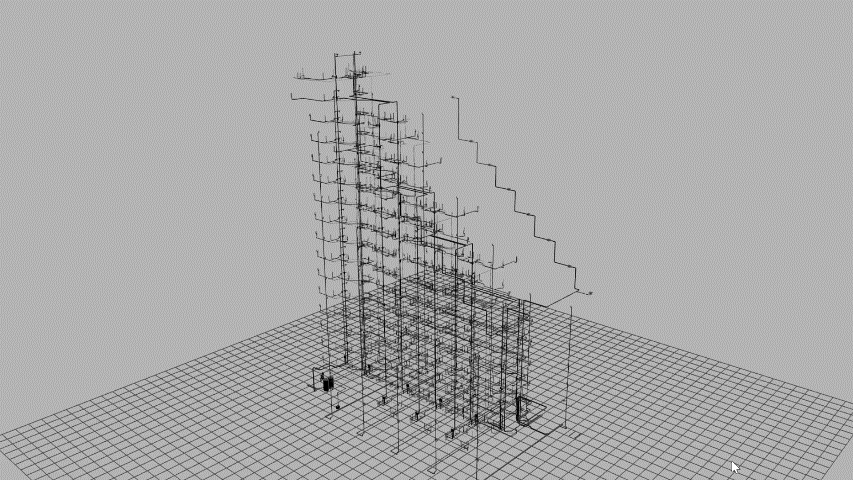

The performance is slow and buggy. I would not want to use this for more than a few minutes at a time. We notice abysmally slow `FPS` (Frames Per Second) as well- ~10 FPS. 60 FPS is considered the gold standard for 3D rendering. Things are even worse if we also try to load the HVAC model.

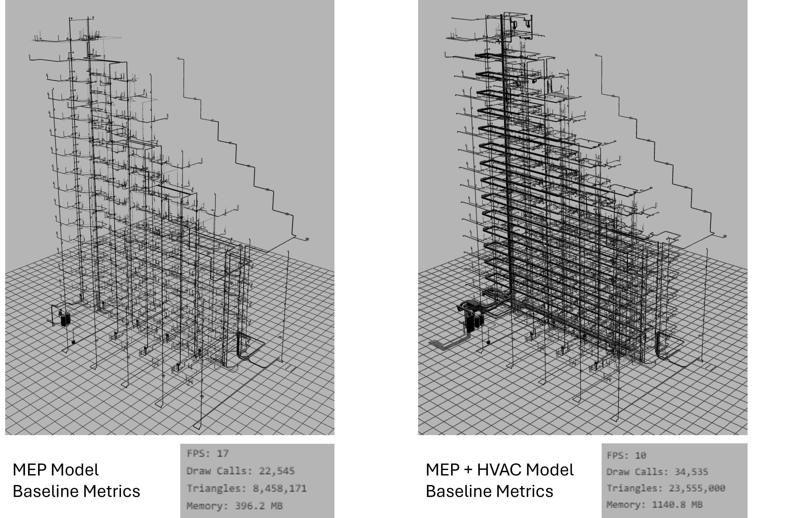

To elaborate more on this point, we conduct the following experiment. Let's load two different layers of our BIM model to our basic scene- the `Interiors/Kitchens` model and the `Architectural` model. Measuring the performance of each, we observe some striking differences.

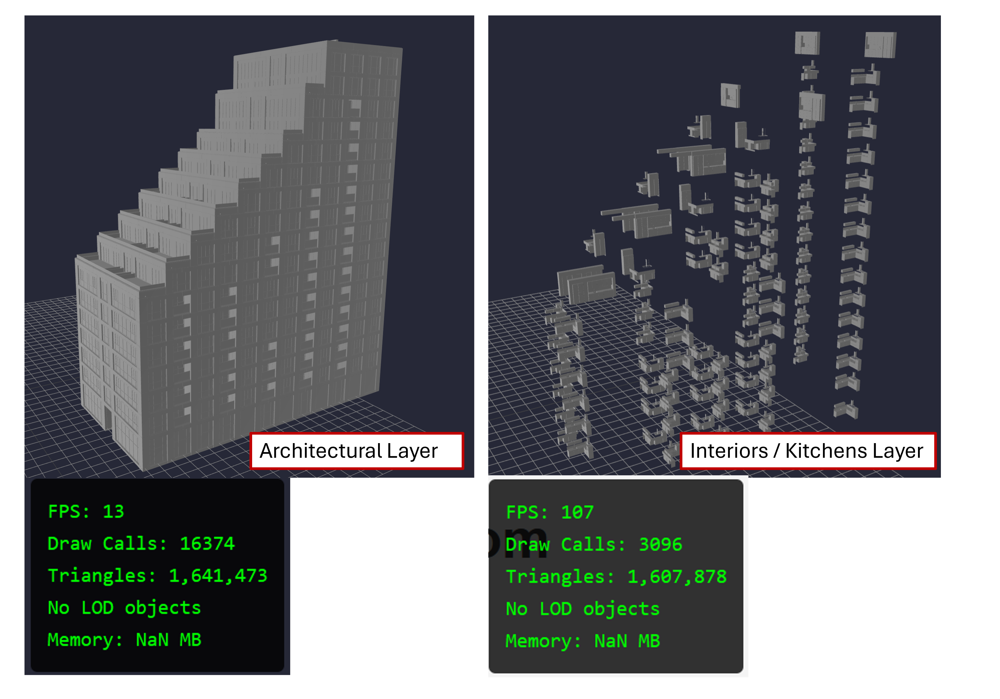

| Model | Draw Calls | Triangles | FPS |
| ----- | ---------- | --------- | --- |
| interiors | 3,096 | ~1.6M | 107 |
| architectural | 16,374 | ~1.6M | 13 |

1) The number of `draw calls` in the kitchens model (3,096) is much less than the architectural model (16,374). This implies there far more individual objects in the `architectural` model than the `interiors` one.

2) The total number of triangles in both scenes are roughly the same (~1.6M). This implies that the interior model is more finely detailed than the architectural model, since the architectural model has more objects.

3) The FPS count for the interior model is ~100 FPS compared to ~13 from the`architectural- significantly lower.

> 2 models, similar number of triangles, but vastly different performance metrics. The only difference is the individual number of objects being rendered.

We conclude from this simple experiment that no matter how capable our GPU is, oftentimes it is CPU bottlenecks that slow us down. We address these bottlenecks through a combination of 2 techniques- `batching` and `instancing`.

## Batching the Scene

To understand how batching works, let's use a familiar example- public transport. Our CPU - GPU pipeline is the equivalent of a highway connecting 2 cities. How do we best move people (data) across this highway? Well, we could send everyone individually in their own cars one at a time. This is analogous to sending one `draw call` for each object in the scene. We can increase the number of lanes in the highway (CPU bandwidth) and improve the throughput. However, as we see in real life- inevitably the traffic clogs and bottlenecks emerge.

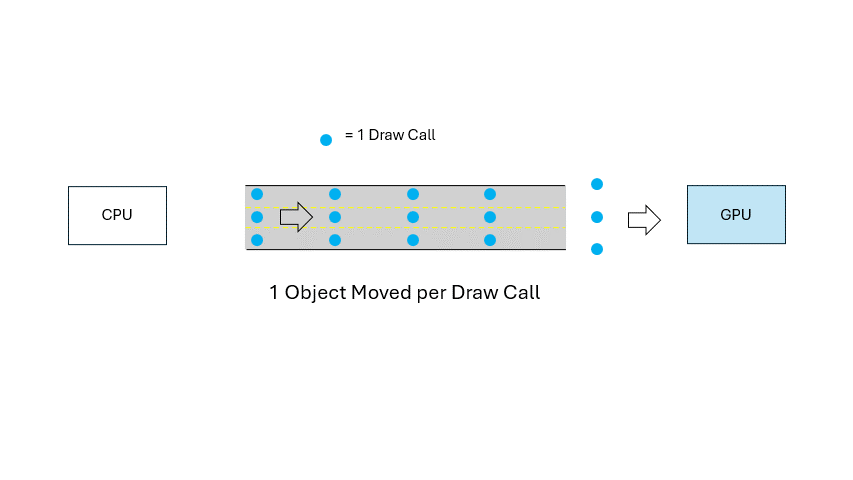

A more efficient approach is to load multiple commuters on a bus and transport that bus across the highway. Now, instead of sending 50 individual cars, we send one bus containing 50 people. The bus utilizes the resources of one `draw call`, while moving moving the equivalent of 50 data points.

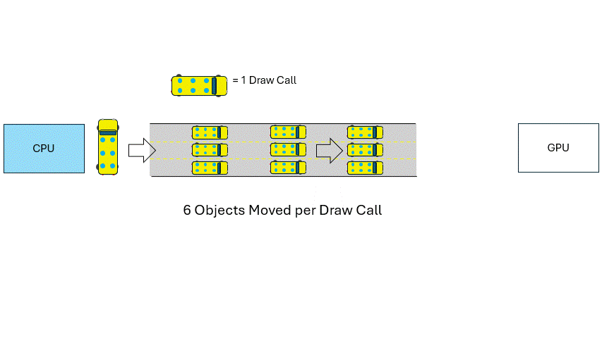

Batching our data allows for its efficient movement between the CPU and GPU.

The main tool at our disposal is included in the standard `three.js` library- [BatchedMesh](https://threejs.org/docs/#BatchedMesh). Utilizing the `BatchedMesh` object requires certain preprocessing to be conducted (similar to how we need to research which bus route number is the one we need).

> Note: This preprocessing step will be explained many times in later sections. This is intentionally done to drive home it's importance.

To efficiently store our objects in the `BatchedMesh`, we need the following 4 data points-

- The number individual objects in the scene,
- The total number of expected `vertices` in the scene,
- The total number of expected `indices` in the scene (the collection of vertices used to construct a `triangle`),
- The unique materials used in the scene.

We acquire this information by iterating through every mesh in our scene, and saving the geometry data to a dictionary. We also keep track of the [transformation matrix](../research/hosting-3d-model/bpy_with_lod.md) of each mesh, as these store the location data of individual objects in the scene.

> Note: We must create one `BatchedMesh` object for every material in the scene. This is due to the architecture of the GPU and [Shader Programs](https://shader-tutorial.dev/basics/introduction/) specifically.

Once complete, our dictionary should look like this.

```yml
material_1
    -> mesh_id_1
        -> geometry_data : [ vertices, faces ]
        -> matrix_data : [ transformation_matrix ]
    -> mesh_id_2
        -> geometry_data : [ vertices, faces ]
        -> matrix_data : [ transformation_matrix ]

    ...

    -> mesh_id_N
        -> geometry_data : [ vertices, faces ]
        -> matrix_data : [ transformation_matrix ]


material_2
    -> mesh_id_1
        -> geometry_data : [ vertices, faces ]
        -> matrix_data : [ transformation_matrix ]

    ...

    -> mesh_id_N
        -> geometry_data : [ vertices, faces ]
        -> matrix_data : [ transformation_matrix ]

...
material_N
    ...
    -> mesh_id_N
        -> geometry_data : [ vertices, faces ]
        -> matrix_data : [ transformation_matrix ]
```

You can find more in-depth explanations on the creation of this dictionary and subsequent `BatchedMesh` objects [in the accompanying research document](../research/optimizing-the-scene/batched-mesh.md).

Now, loading the same `Architectural` model as above with `BatchedMesh` optimizations, this is what we observe.


Just by batching our scene, our FPS count has jumped up to ~70 FPS. All other metrics stayed the same- 1.6M triangles, 16k objects. From the image we observe 38 `draw calls` in our optimized scene. This implies that our scene contains 37 unique materials (one draw call is reserved for the 2D grid).

## Instancing

Another powerful technique to improve the `draw calls` in the scene is known as [`Instancing`](../research/optimizing-the-scene/instanced-mesh.md). This process works best when you have multiple objects in a scene that all share the same geometry. Think leaves on a tree, bolts in a steel beam, 90 degree elbows on a pipe- all these objects are essentially the same, just loaded to different positions.


Since these items all share the exact same geometry, we can send one `draw call` containing the geometry information, alongside a list containing the location information for each individual `instance`.


As a happy side effect, this also improves the memory usage of the scene since we only need to save one object's geometry data, but can reference it many times.

The main `three.js` library once again provides us with tools to address instancing; aptly named [InstancedMesh](https://threejs.org/docs/#InstancedMesh). This object requires the following data ->

- The mesh geometry,
- The mesh material,
- The number of instances.

As described in the section on [`BatchedMesh`](#batching-the-scene), this information can be acquired by looping through the objects in our scene. We slightly tweak our dictionary object from earlier as follows.

- If we encounter an object in the scene whose geometry is exactly the same as another, we do not create a new `mesh_id`. We utilize the existing entry.
- For these instanced geometries, we add the location data of the mesh to `matrices_data`, which is now a list instead of a single entry. As a result, we will have multiple `tranformation_matrices` for a unique piece of geometry.

Here is what our tweaked dictionary looks like.

```yml
material_1
    -> mesh_id_1
        -> geometry_data : [ vertices, faces ]
        -> matrices_data : [ transformation_matrix_1, transformation_matrix_2, ... ]
    -> mesh_id_2
        -> geometry_data : [ vertices, faces ]
        -> matrices_data : [ transformation_matrix_1, transformation_matrix_2, ... ]

    ...

    -> mesh_id_N
        -> geometry_data : [ vertices, faces ]
        -> matrices_data : [ transformation_matrix_1, transformation_matrix_2, ... ]


material_2
    -> mesh_id_1
        -> geometry_data : [ vertices, faces ]
        -> matrices_data : [ transformation_matrix_1, transformation_matrix_2, ... ]

    ...

    -> mesh_id_N
        -> geometry_data : [ vertices, faces ]
        -> matrices_data : [ transformation_matrix_1, transformation_matrix_2, ... ]

...
material_N
    ...
    -> mesh_id_N
        -> geometry_data : [ vertices, faces ]
        -> matrices_data : [ transformation_matrix_1, transformation_matrix_2, ... ]
```

And what do the results look like?

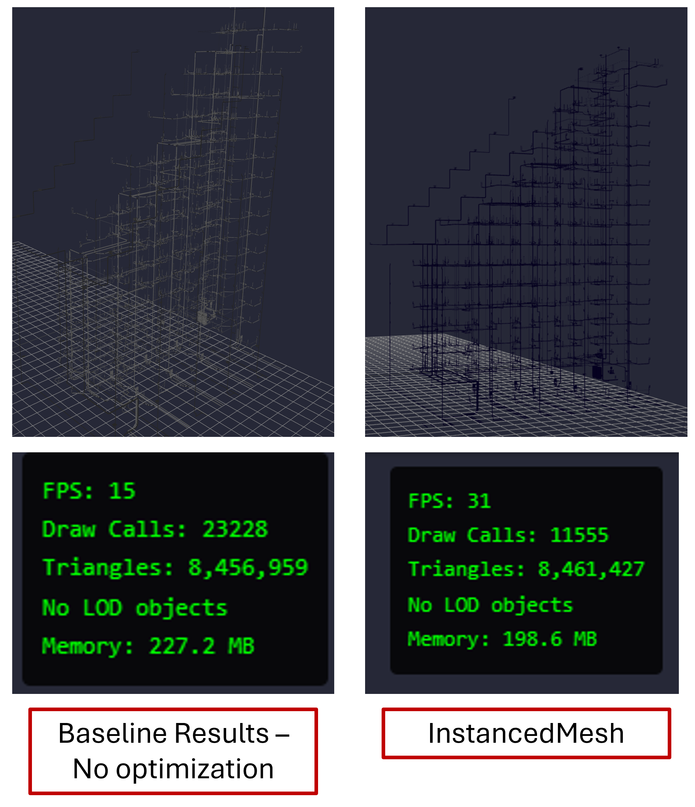

We see a definite improvement over the baseline however, we're not out of the woods yet. Looking at the `InstancedMesh` results, we see one glaringly obvious oversight- the draw calls are still ridiculously high. We have reduced the total number of individual draw calls, but without [Batching](#batching-the-scene), we will still end up running in circles.

To truly optimize our scene, we need to combine the benefits of `instancing` as well as `batching`, and is explained more in the [instanced-mesh research write-up](../research/optimizing-the-scene/instanced-mesh.md). Once we instance AND batch our scene, these are the performance results we see.

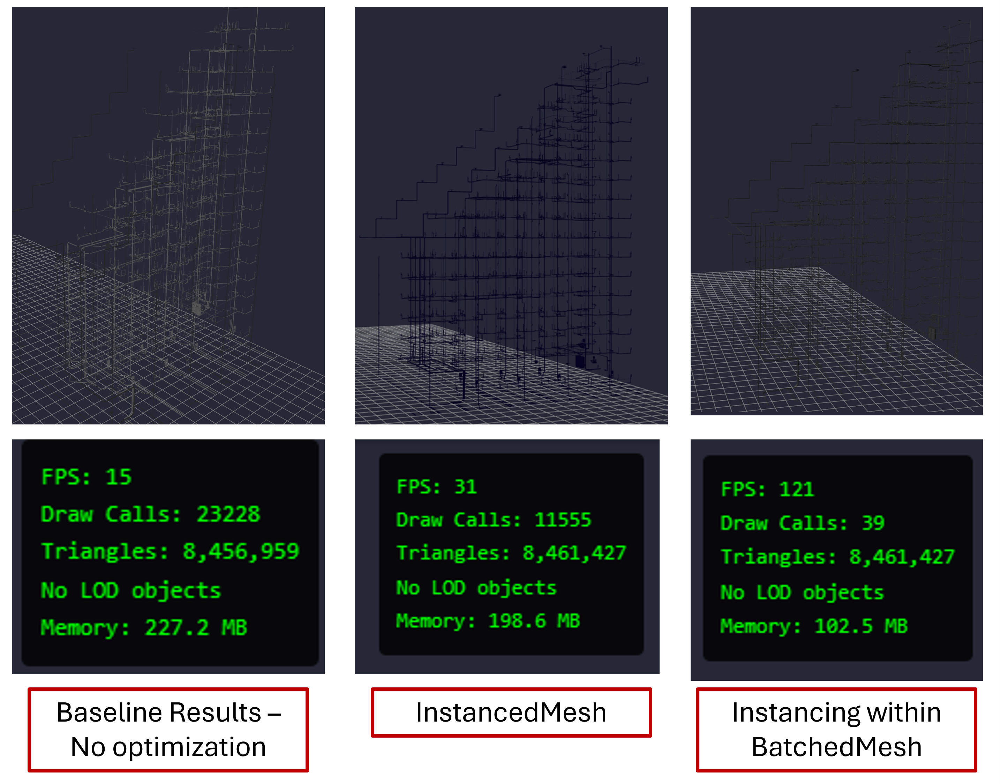

Now that's what I'm talking about. A total of 39 draw calls (one for each material), and a blazing fast performance figure (~120 FPS). This is even better than the [simple batching](../research/optimizing-the-scene/batched-mesh.md) approach from earlier (~70 FPS). As briefly mentioned above, we also notice a drastic reduction in the total memory consumption of the scene.

These results alone would be enough for computers to comfortably render, but we will take this one step further by adding [LOD control](../research/hosting-3d-model/basic-lod-control-with-threejs.md) to the mix.

## LOD Control

Now that we have addressed the `draw calls` issue, the focus shifts back to the GPU side, namely- limiting the number of `triangles` that need to get drawn to the screen. As determined in [previous research](per-object-lod-control-with-threejs.md), this can be managed with Level of Detail (LOD) control. This process entails loading a low resolution mesh to the scene and swapping to a high resolution one when the user zooms in, resulting in vastly improved rendering time.


However, applying this concept to our `BatchedMesh` object requires some additional thinking. For starters, we no longer have individual objects in our scene- we have `instances`. As well, all the mesh data is stored within an existing data structure- the `batchedMesh`, hence our previously implemented [three.LOD()](https://threejs.org/docs/#LOD) class of objects wont work.

Instead, we need to manually populate our `batchedMesh` object with the different LOD's. For each unique goemetry in the scene, we now also need to save our mesh's low-resolution geometry. Hence, we tweak our dictionary object yet once again, according to the following rules.

- We populate our dictionary as normal using the data from our HI-RES model.
- Now, we iterate over all objects in the LOW-RES model.
- If we encounter an object in the scene whose `mesh_id` is the same as our HI-RES model, we find that entry in the dictionary, and save the new LOW-RES geometry.
- Since these 2 objects share the same location in space, we do not need to touch the `matrices_data`- the HI-RES mesh already contains this info.

Now, our final dictionary looks like this.

```yml
material_1
    -> mesh_id_1
        -> geometry_data 
            -> hi_res_mesh : [ vertices, faces ]
            -> lo_res_mesh : [ vertices, faces ]
        -> matrices_data : [ transformation_matrix_1, transformation_matrix_2, ... ]
    -> mesh_id_2
        -> geometry_data 
            -> hi_res_mesh : [ vertices, faces ]
            -> lo_res_mesh : [ vertices, faces ]
        -> matrices_data : [ transformation_matrix_1, transformation_matrix_2, ... ]

    ...

    -> mesh_id_N
        -> geometry_data 
            -> hi_res_mesh : [ vertices, faces ]
            -> lo_res_mesh : [ vertices, faces ]
        -> matrices_data : [ transformation_matrix_1, transformation_matrix_2, ... ]


material_2
    -> mesh_id_1
        -> geometry_data 
            -> hi_res_mesh : [ vertices, faces ]
            -> lo_res_mesh : [ vertices, faces ]
        -> matrices_data : [ transformation_matrix_1, transformation_matrix_2, ... ]

    ...

    -> mesh_id_N
        -> geometry_data 
            -> hi_res_mesh : [ vertices, faces ]
            -> lo_res_mesh : [ vertices, faces ]
        -> matrices_data : [ transformation_matrix_1, transformation_matrix_2, ... ]

...
material_N
    ...
    -> mesh_id_N
        -> geometry_data 
            -> hi_res_mesh : [ vertices, faces ]
            -> lo_res_mesh : [ vertices, faces ]
        -> matrices_data : [ transformation_matrix_1, transformation_matrix_2, ... ]
```

Here is a graphic to help understand how the dictionary is populated.


Now, we just need to write some logical code that tests the distance between our camera and the objects in the scene. If the distance is less than a certain threshold, swap the mesh to hi-res; else keep it at low-res. And voila! We have a working LOD system. Here are the performance metrics.


Some interesting observations. The number of triangles in the scene is down- roughly 10% of the original 8M. Draw calls are constant, ([consistent with our previous research](improving-3d-model-performance-with-LOD.md)).

However, the FPS figure is still on the lower side. Running some diagnostic tests, we see that the CPU is still dominating the resources of the scene. Digging a little further, we see that our LOD system is conducting distance checks between our camera and every object in the scene, every frame. Since we have a large number of objects, this is ultimately whats causing the slowdown.


We want to find the closest objects to our camera, while limiting the number of distance checks being conducted. That's where `Spatial Querying` comes into play.

## Spatial Querying

[Spatial querying requires its own document to fully appreciate](https://github.com/suryashch/octree/blob/main/reports/octree.md). Here, we condense down to the basics. How do you efficiently test multiple objects' distance against a point? As described in the section above, we could naively calculate the distance between every point and our camera; check to see if its within a specified radius, and return TRUE or FALSE. For small scenes, this is perfectly fine and internally, is how the [Three.LOD()](https://threejs.org/docs/#LOD) system works.


However, in our case we have 10's of thousands of objects, AND we're conducting this distance check every single frame. An immense slowdown, and its reflected in our observed low FPS results.

We can speed things up by utilizing a data structure known as an `Octree`. An `Octree` is created by recursively subdividing a 3D space into 8 equal cubes. These cubes store data about the objects contained within them. Each cube can be thought of as a node, or 'level' of a tree.

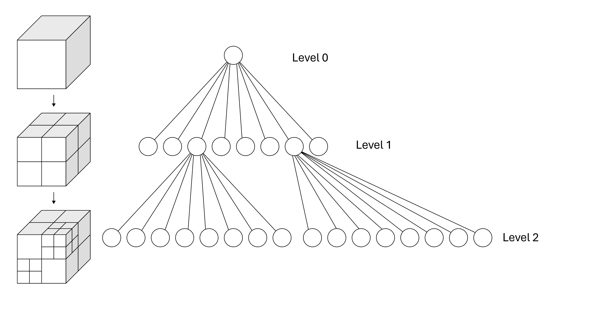

The mechanics are best understood through a working example. We create a test 3D space populated with sample objects, shown in yellow. The red `X` represents our camera location in this space.

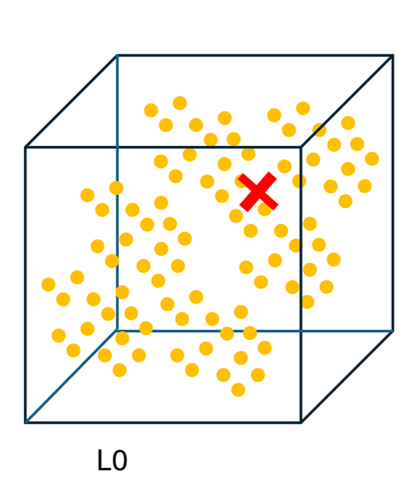

Our goal here is to return all the points that are within a specified radius from our camera. We start by dividing the space in 8 cubes. Now, instead of measuring the distance between our camera and every point, we measure the distance between our camera and each of these 8 cubes. If the cube is outside our search radius, we can **immediately discard all objects within that cube**.

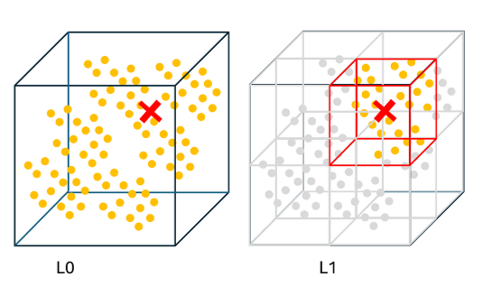

In one swoop, we have vastly reduced the number of sample objects. If a cube meets the distance critera, we divide it into a further 8 cubes and run another distance check at this lower level.

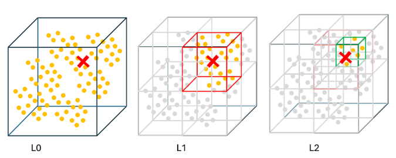

Just through 16 calculations, we were already able to narrow down the number of sample objects to ~1.5% of the original. At this point, we could go further down into the `octree` or, if the number of subsetted objects is sufficiently low- just conduct a normal distance check function on this subset. In either case, we have achieved significant computational savings. In data science terms, we have successfully converted the function's time complexity from O(n) to O(log n).

*placeholder table*

In this project, I'm working with a special flavour of `octree` called a `Bounding Volume Hierarchy` (BVH). This data structure works the same way as an `octree` except, the cubes are drawn as bounding boxes around the objects. It is best suited for scenes where objects are condensed in a small space. The [Wikipedia article](https://en.wikipedia.org/wiki/Bounding_volume_hierarchy) on BVH's is actually a great resource for understanding its workings.

The tools we need to make this work for our scene are saved in an add-on library to three.js, called [three-mesh-bvh](https://github.com/gkjohnson/three-mesh-bvh), by gkjohnson.

Once this search system is implemented into our scene, we are presented with these results.


A definite improvement over previous results, and a promising step forward. However, the FPS figure is still lower than I'd like- and now as a last step, we work on optimizing the frame loop.

## Frame Updates

A 3D scene is essentially a group of functions that update the pixels on the screen based on user input, known as a `Frame Loop`. Depending on your screen's refresh rate, the `frame loop` can run 60 times per second (60 FPS), or anywhere upto 240 FPS like in high-end gaming machines. Usually, we wouldn't think about this too much, and adequate results can be achieved even with every function running every frame.

However, if we take a look at the different tasks in our `frame loop`, we can start to see why our performance figure is low.

Every frame, our CPU is -

- Checking for user inputs- mouse clicks, scrolling, panning.
- Updating the camera position based on mouse movements.
- Running our octree search algorithm and determining which objects are within our search critera.
- Sending the associated `draw calls` to the GPU.

Quite a lot of work being done every frame- and really, it doesn't need to be.

- Our LOD's will only need to be swapped when the user zooms in.
- The camera position will only need to be updated if the user clicks and moves the mouse.
- The draw calls will only need to be sent if the camera's position has changed.

The rest of the time, our scene can sit idle- consuming minimal resources.

Hence, we optimize the frame loop, by adding [`eventListeners`](https://www.geeksforgeeks.org/javascript/javascript-addeventlistener-with-examples/). These webpage elements listen for user input such as mouse movement, clicks, scrolls, and can be set up to run a function on trigger.

- We set up an `eventListener` for mouse scrolling, and trigger it to run our LOD checking function.

- We set up an `eventListener` for mouse clicks, and trigger it to run our camera update function. Mouse clicks correspond to camera movement (left click to rotate, right click to pan), so if the user clicks on the screen, our camera should update.

- And lastly, we set up an `eventListener` for mouse movement, and trigger it to send the draw calls. A mouse click (pan, rotate) is usually followed by mouse movement- hence, to maintain the 60FPS feel we need to send draw calls every time the mouse moves.

We will still have these set of functions in the main `frame loop`, but we can significantly throttle it down to only run once every second (1 FPS). This way, even if the user does nothing, the scene can still update with any queued changes.

Now, here is what the final scene looks like.


Beautiful results. The page runs at 60 FPS, especially when idle. On movement, we see a slight drop down to 40 FPS (still high, but definitely lower). This drop in FPS quickly returns back to normal once the user zooms in, or stops mmoving.

Zooming in to an area causes an instant switch of object's LOD based on the search radius. Taking your hand off the mouse results in minimal resource utilization, and the scene will run with almost no overhead (as verified in the Task Manager).


Adding additional model layers to the scene results in higher initial load time, but our engine is perfectly capable of rendering these additional objects. The final performance metrics with every layer active in the scene looks like this.


## A Note on Memory

At this point, the results from our effort seem too good to be true. The CPU and GPU's work has been thoroughly optimized and our scene is running at a crisp 60 FPS. But as with real life, there is no such thing as a free lunch.

Taking a look at the memory consumption of the webpage, the numbers are large, and this is because our LOD system is effectively "doubling" the number of objects in our scene. For each object, we save a low-res and hi-res mesh to memory, and while these are never active at the same time- they both need to be stored to RAM for quick access.

Improvements can be made through instancing ([as seen in the above section](#instancing)), but the scene can only be instanced up to a limit. This is a known trade-off, and one which I will address at a later time.

## Packaging it Together

Let's recap. A BIM model poses 3 main challenges ->

- A large number of `draw calls` being sent to the GPU,
- A large number of `triangles`, needing to be rendered to the screen,
- A busy CPU rendering loop, needing continuous updates.

Since there are so many objects in the scene, the CPU was sending 1,000's of `draw calls` every frame to the GPU, causing a massive bottleneck. We addressed this issue by [batching our scene](#batching-the-scene); consolidating multiple similar objects into one container and sending that one container as a single draw call. We also identified [duplicated geometry](#instancing) in the scene, consolidating those further to reduce redundancy.

At this point our bottleneck shifted from the CPU to the GPU- all these objects had hundreds of individual `triangles`, drastically increasing the load on the GPU. To address this issue, we created a highly condensed low-res version of the mesh and loaded it to the scene. We triggered the mesh to swap back to full resolution when our camera zoomed in enough. This added a cap to the total number of triangles being rendered to the screen, improving the GPU's performance.

Lastly, this mesh-swapping function added additional CPU overhead; eating up the resources of each frame in our scene. We addressed this by implementing a smart `Octree` based search system to our function, narrowing down its scope. We also triggered it to only run when our user moves around the scene, remaining idle the rest of the time.


The final implementation runs on average at 40-60 FPS, and improves drastically when zoomed in.

## Results

Comparison of the full model's performance to a baseline proved to be a tough task- I could not even move one frame when I naively loaded all my data to the scene. However, we were able to isolate results when strictly looking at the strictly the MEP layer of our model.


An important finding here is that the scene's performance scales extremely well with an increase in model size. With instancing, batching and LOD control, we can effectively "cap" the total number of draw calls and triangles needing to be rendered to the screen. As well, the distance testing algorithm sclaes in log time, i.e. as the data scales by a factor of N, the time taken to run our algorithm only increases by a factor of log(N).

## Conclusion and Next Steps

Building Information Modelling (BIM) combines the best practices of data science with a rich visual overlay. Over the past few years, the tools for managing the data aspect have improved to the point that they can be implemented by most with relative ease. However, the tools for viewing this data have remained mostly the same: closed door and inaccessible to most.

Through this endeavour, we established that large 3D models can be efficiently hosted and viewed on a webpage. We explored techniques used by video game developers such as `Batching`, `Instancing`, `LOD Control`, and `Spatial Querying` to improve the performance of the final scene- containing 5 layers, 60k individual objects, and a whopping 25M triangles. Despite these massive numbers, the scene runs at a comfortable ~40 FPS (60 when zoomed in). When idle, the scene throttles down- vastly reducing the CPU and GPU resource utilization (you may even notice your computer's fan shut off!).

A quick note, that the performance figures seen in my implementation will be slightly different depending on the hardware you have available. The results listed here are representative of modest hardware specs.

In further research, I explore adding interactivity- controlling the objects rendered to the screen based on data filters, enabling data input and collection, and improving data visualization capabilities through color gradients. As well, I explore memory management, tailoring the experience for machines with lower available RAM.

You can find more information about this research on my [github](https://github.com/suryashch/3d_modelling).

## Links

[transformation matrices](../research/hosting-3d-model/bpy_with_lod.md)

[full code](https://github.com/suryashch/LOD-control-with-threeJS)

[Unity](https://unity.com/)

[Unreal Engine](https://www.unrealengine.com/)

[three.js](https://threejs.org/)

[known as vertices and edges](../research/reducing-mesh-density/analysis_decimate.md)

[research body of knowledge](../research/optimizing-the-scene/batchedmesh-with-LOD.md)

[buildingsmart-community](https://github.com/buildingsmart-community)

[prior work](improving-3d-model-performance-with-LOD.md)

[BatchedMesh](https://threejs.org/docs/#BatchedMesh)

[basic scene](analysis_threejs.md).

[Sixty5](https://www.strijp-s.nl/en/building/sixty5)

[Shader Programs](https://shader-tutorial.dev/basics/introduction/)

[Instancing Example](../research/optimizing-the-scene/img/instancing-threejs-example.gif)

[InstancedMesh](https://threejs.org/docs/#InstancedMesh)

[LOD control](../research/hosting-3d-model/basic-lod-control-with-threejs.md)

[Three.LOD()](https://threejs.org/docs/#LOD)

[`eventListeners`](https://www.geeksforgeeks.org/javascript/javascript-addeventlistener-with-examples/)

[Wikipedia article](https://en.wikipedia.org/wiki/Bounding_volume_hierarchy)